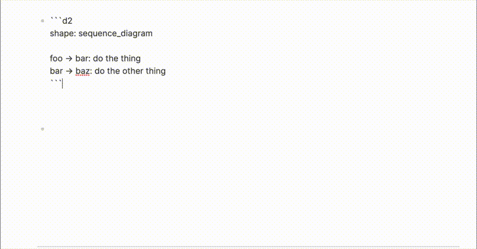

# logseq-d2

A [Logseq](https://logseq.com) plugin that renders [D2](https://d2lang.com) diagrams in fenced code blocks. Compiles D2 to SVG entirely client-side using the official D2 WASM engine — no server, no API calls, works offline.



## Usage

Create a fenced code block with the `d2` language identifier:

````markdown
```d2
server -> database: queries
database -> cache: invalidates
```
````

Click outside the block and the diagram renders automatically. Click the diagram to edit. All [D2 shapes](https://d2lang.com/tour/shapes) are supported.

## Settings

Configure via Logseq plugin settings:

| Setting | Options | Default |
|---------|---------|---------|
| Layout Engine | dagre, elk | dagre |
| Sketch Mode | true/false | false |
| Theme | 15 built-in themes | 0 (default) |

## Install from source

```sh
git clone https://github.com/edjeffreys/logseq-d2
cd logseq-d2
npm install
npm run build
```

In Logseq: Plugins > Load unpacked plugin > select the `logseq-d2` directory.

## Development

```sh
npm run watch
```

Rebuilds on file changes. Reload the plugin in Logseq to pick up changes.

## How it works

Uses [`@terrastruct/d2`](https://www.npmjs.com/package/@terrastruct/d2) — the official D2 WASM package from Terrastruct (the same engine powering [play.d2lang.com](https://play.d2lang.com)). Rendering happens entirely in-browser via `logseq.Experiments.registerFencedCodeRenderer`.

## License

MIT
